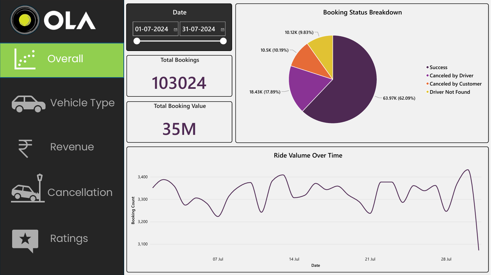
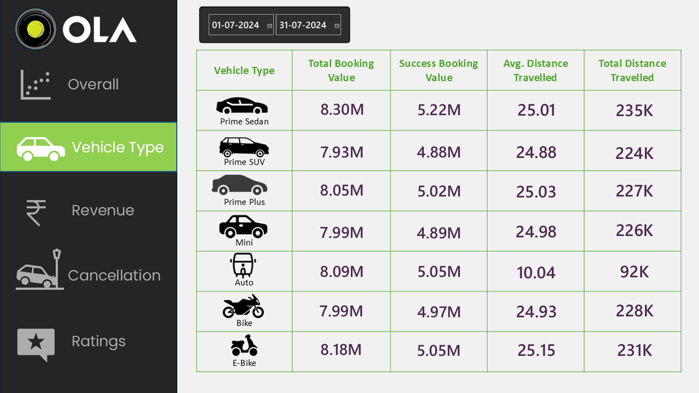
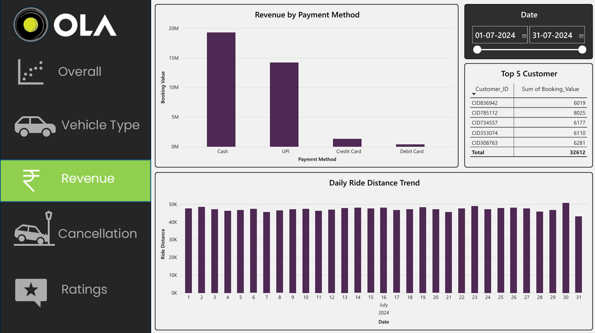
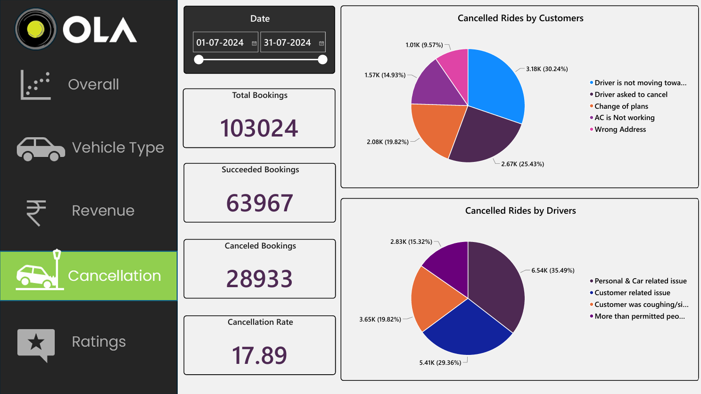
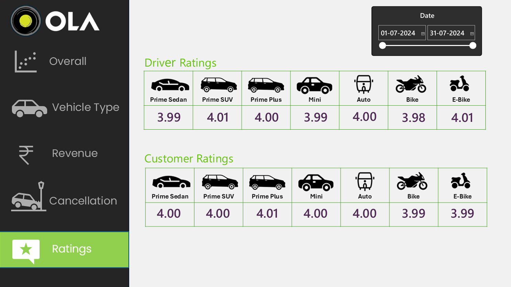

# 🚕 Ola Bookings Data Analysis | MySQL & Power BI

An end-to-end data analytics project using **MySQL and Power BI** to analyze Ola ride bookings, identify booking trends, evaluate cancellation patterns, and explore revenue and customer ratings.

## 📌 Project Overview

This project analyzes Ola ride booking data for **July 2024**, containing **103,024 bookings**. MySQL is used to perform SQL-based analysis, while Power BI is used to build an interactive dashboard that presents key metrics and business insights.

## 🛠️ Tools & Technologies

* **MySQL** – Data analysis and SQL queries
* **Power BI** – Interactive dashboard and data visualization
* **Power Query** – Data transformation
* **DAX** – Calculated measures and KPIs
* **CSV** – Dataset format

## 📊 Power BI Dashboard

The dashboard contains five pages:

| Dashboard Page | Description                                            |
| -------------- | ------------------------------------------------------ |
| Overall        | Overview of booking performance and key metrics        |
| Vehicle Type   | Analysis of bookings and ride distance by vehicle type |
| Revenue        | Revenue analysis and daily ride distance trends        |
| Cancellation   | Customer and driver cancellation analysis              |
| Ratings        | Analysis of customer and driver ratings                |

## 📈 Key Metrics & Insights

* **Total Bookings:** 103,024
* **Successful Bookings:** 63,967
* **Canceled by Customer:** 10,499
* **Canceled by Driver:** 18,434
* **Driver Not Found:** 10,124
* **Total Booking Value:** ₹56.53 million (approximately)
* **Successful Ride Value:** ₹35.08 million (approximately)
* **Combined Customer and Driver Cancellation Rate:** 28.08%
* **Driver Cancellation Rate:** 17.89%

## 🗄️ SQL Analysis

The project includes the following SQL analyses:

* Retrieve all successful bookings.
* Calculate average ride distance for each vehicle type.
* Analyze customer cancellations.
* Identify the top 5 customers by number of bookings.
* Analyze driver cancellation reasons.
* Find maximum and minimum driver ratings for Prime Sedan.
* Analyze bookings paid through UPI.
* Calculate average customer ratings by vehicle type.
* Calculate the total value of successful rides.
* Identify incomplete rides and their reasons.

## 📷 Dashboard Screenshots

### 1. Overall Dashboard



### 2. Vehicle Type Analysis



### 3. Revenue Analysis



### 4. Cancellation Analysis



### 5. Ratings Analysis



## 📁 Project Structure

```text
Ola-Bookings-Data-Analysis/
│
├── data/
│   └── Bookings.csv
│
├── powerbi/
│   ├── Ola.pbix
│   └── Ola.pdf
│
├── sql/
│   └── Ola_Bookings_SQL_Queries.pdf
│
├── visuals/
│   ├── cancellation.png
│   ├── overall.png
│   ├── ratings.png
│   ├── revenue.png
│   └── vehicle_type.png
│
└── README.md
```

## 🎯 Project Objectives

* Analyze overall ride booking performance.
* Understand customer and driver cancellation patterns.
* Compare booking and ride-distance metrics across vehicle types.
* Examine revenue and payment-related trends.
* Analyze customer and driver ratings.
* Present meaningful insights through an interactive Power BI dashboard.

## 👤 Author

**Niku Kumar Yadav**
